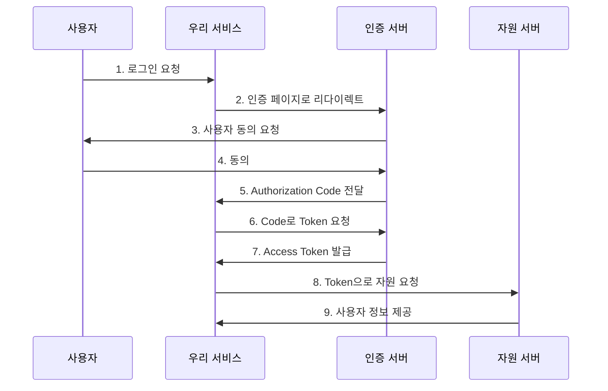

# OAuth 인증 가이드

## 1. OAuth란?

OAuth(Open Authorization)는 사용자 인증과 권한 부여를 위한 개방형 표준 프로토콜입니다. 이를 통해 사용자는 자신의 정보를 제3자 애플리케이션과 안전하게 공유할 수 있습니다.

## 2. 주요 용어

- **Resource Owner**: 서비스를 이용하려는 사용자
- **Client**: 우리 서비스 (제3자 애플리케이션)
- **Authorization Server**: 인증 서버 (Google/Naver/Kakao의 인증 서버)
- **Resource Server**: 사용자의 정보를 가진 서버
- **Access Token**: 자원 접근을 위한 토큰
- **Refresh Token**: Access Token 재발급을 위한 토큰

## 3. OAuth 2.0 인증 흐름

### Authorization Code Flow



## 4. 소셜 로그인 제공자별 설정

### 4.1 Google

```typescript
const googleConfig = {
    auth_uri: 'https://accounts.google.com/o/oauth2/v2/auth',
    token_uri: 'https://oauth2.googleapis.com/token',
    scope: 'email profile',
    redirect_uri: '/api/v1/auth/google/callback'
};
```

### 4.2 Naver

```typescript
const naverConfig = {
    auth_uri: 'https://nid.naver.com/oauth2.0/authorize',
    token_uri: 'https://nid.naver.com/oauth2.0/token',
    scope: 'email name',
    redirect_uri: '/api/v1/auth/naver/callback'
};
```

### 4.3 Kakao

```typescript
const kakaoConfig = {
    auth_uri: 'https://kauth.kakao.com/oauth/authorize',
    token_uri: 'https://kauth.kakao.com/oauth/token',
    scope: 'profile_nickname account_email',
    redirect_uri: '/api/v1/auth/kakao/callback'
};
```

## 5. 보안 고려사항

### 5.1 필수 보안 설정

- HTTPS 사용 필수
- Client Secret 보안 유지
- State 파라미터를 통한 CSRF 방지
- Access Token은 서버에서만 관리

### 5.2 토큰 관리

```typescript
// Access Token 저장 (서버 측)
session.access_token = token.access_token;
session.refresh_token = token.refresh_token;
session.expires_at = Date.now() + (token.expires_in * 1000);
```

### 5.3 에러 처리

```typescript
try {
    const token = await oauth.getAccessToken(code);
} catch (error) {
    if (error.response?.status === 401) {
        // 인증 실패
    } else if (error.response?.status === 403) {
        // 권한 없음
    } else {
        // 기타 에러
    }
}
```

## 6. 구현 예시

### 6.1 프론트엔드 로그인 버튼

```typescript
const LoginButton: React.FC<LoginButtonProps> = ({ provider }) => {
    const handleLogin = () => {
        window.location.href = `${API_ENDPOINT}/auth/${provider}/login`;
    };

    return (
        <Button 
            onClick={handleLogin}
            className={`login-btn-${provider}`}
        >
            {provider} 계정으로 로그인
        </Button>
    );
};
```

### 6.2 백엔드 콜백 처리

```python
@router.get("/{provider}/callback")
async def oauth_callback(
    provider: str,
    code: str,
    state: str = None,
    db: AsyncSession = Depends(get_db)
):
    oauth_service = get_oauth_service(provider)
    token = await oauth_service.get_access_token(code)
    user_info = await oauth_service.get_user_info(token)
    
    user = await user_service.get_or_create_oauth_user(
        provider=provider,
        oauth_id=user_info['id'],
        email=user_info['email'],
        name=user_info['name']
    )
    
    session = await create_user_session(user.id)
    return RedirectResponse(
        url=f"{settings.FRONTEND_URL}",
        cookies={"session_id": session.session_id}
    )
```

## 7. 환경 변수 설정

```env
# Google OAuth
GOOGLE_CLIENT_ID=your_client_id
GOOGLE_CLIENT_SECRET=your_client_secret

# Naver OAuth
NAVER_CLIENT_ID=your_client_id
NAVER_CLIENT_SECRET=your_client_secret

# Kakao OAuth
KAKAO_CLIENT_ID=your_client_id
KAKAO_CLIENT_SECRET=your_client_secret

# 공통 설정
OAUTH_REDIRECT_URI=https://your-domain.com/api/v1/auth/{provider}/callback
```

## 8. 참고 사항

- 각 소셜 로그인 제공자의 개발자 콘솔에서 애플리케이션 등록 필요
- Redirect URI는 반드시 등록된 도메인과 일치해야 함
- 테스트 시에는 localhost도 등록 필요
- 실제 서비스 배포 시 도메인 추가 등록 필요
