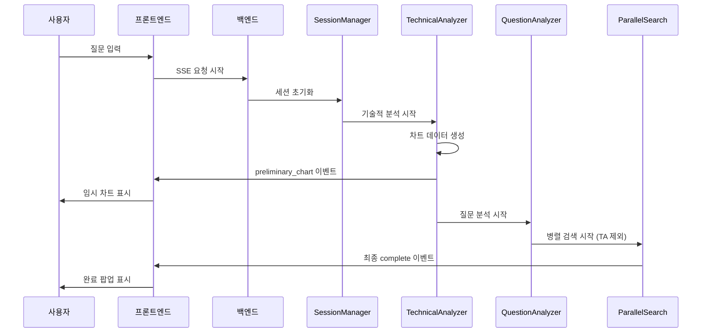
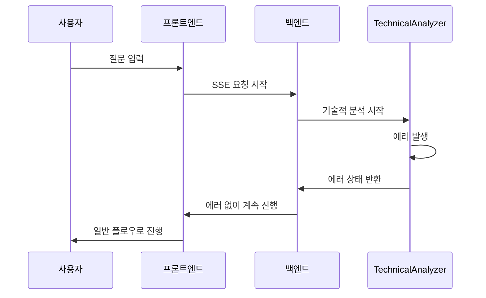

# 실시간 차트 스트리밍 기능 기술명세서

## 1. 개요

### 1.1 목적
사용자가 질문 입력 후 70-100초의 긴 대기시간을 개선하기 위해, Technical Analyzer 에이전트를 먼저 실행하여 기술적 분석 차트를 5-10초 내에 먼저 제공하는 기능을 구현합니다.

### 1.2 핵심 요구사항
- 사용자 질문 입력 후 5-10초 내에 기술적 분석 차트 제공
- 기존 UI 구조 변경 없이 구현
- LangGraph 멀티에이전트 워크플로우 내에서 처리
- 안정적인 스트리밍 및 에러 핸들링

### 1.3 사용자 시나리오
1. 사용자가 질문 입력
2. 5-10초 후 기술적 분석 차트 표시 (preliminary_chart 이벤트)
3. 사용자는 차트를 보며 나머지 60-80초 대기
4. 전체 분석 완료 시 팝업으로 알림
5. 사용자가 "보러가기" 클릭하여 최종 문서 확인

## 2. 시스템 아키텍처

### 2.1 워크플로우 변경

#### 기존 플로우
```
session_manager → question_analyzer → orchestrator → parallel_search
```

#### 새로운 플로우
```
session_manager → technical_analyzer → question_analyzer → orchestrator → parallel_search
```

### 2.2 에이전트 실행 순서
1. **session_manager**: 세션 초기화
2. **technical_analyzer**: 기술적 분석 수행 및 중간 결과 스트리밍
3. **question_analyzer**: 질문 의도 분석
4. **orchestrator**: 실행 계획 수립
5. **parallel_search**: 나머지 에이전트들 병렬 실행 (technical_analyzer 제외)

### 2.3 스트리밍 이벤트 구조

#### preliminary_chart 이벤트
```json
{
  "event": "preliminary_chart",
  "data": {
    "components": [
      {
        "type": "heading",
        "level": 2,
        "content": "📊 삼성전자(005930) 실시간 기술적 분석"
      },
      {
        "type": "technical_indicator_chart",
        "title": "삼성전자 기술적 지표",
        "data": { ... }
      },
      {
        "type": "price_chart", 
        "title": "삼성전자 주가 및 거래량",
        "data": { ... }
      }
    ],
    "message": "📊 삼성전자의 기술적 분석 차트가 준비되었습니다. 추가 분석을 진행하는 동안 차트를 먼저 확인해보세요.",
    "agent": "technical_analyzer",
    "timestamp": 1703123456.789,
    "elapsed": 8.52,
    "stock_code": "005930",
    "stock_name": "삼성전자"
  }
}
```

## 3. 백엔드 구현

### 3.1 StockAnalysisGraph 수정

#### 파일: `backend/stockeasy/graph/stock_analysis_graph.py`

```python
def _build_graph(self, db: AsyncSession = None):
    # 새로운 워크플로우 엣지 설정
    workflow.add_edge("session_manager", "technical_analyzer")
    workflow.add_edge("technical_analyzer", "question_analyzer")
    
    # 질문 분석기 이후 라우팅
    workflow.add_conditional_edges(
        "question_analyzer", 
        question_analyzer_router,
        {
            "orchestrator": "orchestrator",
            "context_response": "context_response", 
            END: END
        }
    )
```

### 3.2 TechnicalAnalyzerAgent 수정

#### 파일: `backend/stockeasy/agents/technical_analyzer_agent.py`

##### 핵심 기능
- `streaming_callback`을 통한 중간 결과 즉시 전송
- 차트 컴포넌트 생성 및 SSE 이벤트 생성
- agent_results에 preliminary_sent 플래그 저장

```python
async def process(self, state: AgentState) -> AgentState:
    # 기술적 분석 수행
    technical_analysis_result = await self._perform_technical_analysis(
        stock_code=stock_code,
        stock_name=stock_name
    )
    
    # 차트 컴포넌트 생성
    preliminary_components = await self._create_preliminary_chart_components(
        technical_analysis_result, stock_code, stock_name
    )
    
    # streaming_callback으로 즉시 전송
    if streaming_callback and preliminary_components:
        preliminary_event = {
            "event": "preliminary_chart",
            "data": { ... }
        }
        event_data = json.dumps(preliminary_event, cls=DateTimeEncoder)
        await streaming_callback(f"{event_data}\n\n")
```

### 3.3 ParallelSearchAgent 수정

#### 파일: `backend/stockeasy/agents/parallel_search_agent.py`

##### 변경사항
- `technical_analyzer`를 실행 대상에서 제외
- 이미 실행된 technical_analyzer 상태 확인

```python
async def process(self, state: AgentState) -> AgentState:
    for agent_name in self.search_agent_names:
        if agent_name == "technical_analyzer":
            # 이미 실행되었으므로 건너뜀
            logger.info(f"기술적 분석은 이미 완료되어 건너뜁니다: {agent_name}")
            continue
        # 나머지 에이전트 처리...
```

## 4. 프론트엔드 구현

### 4.1 새로운 상태 관리

#### 파일: `frontend/stockeasy/app/components/chat/AIChatArea/components/MessageComponentRenderer.tsx`

```typescript
interface PreliminaryChartData {
  components: MessageComponent[];
  message: string;
  timestamp: number;
  stockCode: string;
  stockName: string;
}

const [preliminaryChart, setPreliminaryChart] = useState<PreliminaryChartData | null>(null);
const [showCompletionPopup, setShowCompletionPopup] = useState(false);
const [finalResponse, setFinalResponse] = useState<any>(null);
```

### 4.2 SSE 이벤트 처리

```typescript
const handleStreamEvent = (eventData: string) => {
  const event = JSON.parse(eventData);
  
  switch (event.event) {
    case 'preliminary_chart':
      setPreliminaryChart({
        components: event.data.components,
        message: event.data.message,
        timestamp: event.data.timestamp,
        stockCode: event.data.stock_code,
        stockName: event.data.stock_name
      });
      setCurrentStatus("📊 차트가 준비되었습니다. 추가 분석을 진행하고 있습니다...");
      break;
    // 기타 이벤트 처리...
  }
};
```

### 4.3 UI 컴포넌트

#### PreliminaryChartDisplay 컴포넌트
- 실시간 배지 표시
- 차트 컴포넌트 렌더링
- 로딩 애니메이션
- 진행 상태 메시지

#### CompletionPopup 컴포넌트
- 분석 완료 알림
- "상세 보고서 보기" 버튼
- 슬라이드 인 애니메이션

### 4.4 렌더링 로직

```typescript
return (
  <div className="chat-container">
    {/* 기존 상태 메시지 */}
    {isProcessing && <StatusMessage message={currentStatus} />}
    
    {/* 임시 차트 표시 */}
    {preliminaryChart && !finalResponse && (
      <PreliminaryChartDisplay chartData={preliminaryChart} />
    )}
    
    {/* 완료 팝업 */}
    {showCompletionPopup && (
      <CompletionPopup onViewFinalReport={handleViewFinalReport} />
    )}
    
    {/* 최종 메시지들 */}
    {finalResponse && <MessageRenderer message={finalResponse} />}
  </div>
);
```

## 5. 데이터 플로우

### 5.1 정상 플로우



### 5.2 에러 플로우



## 6. 에러 핸들링

### 6.1 Technical Analyzer 실패 시
- 에러 로깅 후 일반 플로우로 계속 진행
- preliminary_chart 이벤트 전송하지 않음
- 사용자에게는 일반적인 처리 과정으로 표시

### 6.2 스트리밍 실패 시
- streaming_callback 오류 시 로깅 후 계속 진행
- 중간 결과 전송 실패해도 최종 결과에는 영향 없음

### 6.3 프론트엔드 에러 핸들링
- JSON 파싱 오류 시 해당 이벤트 무시
- 컴포넌트 렌더링 오류 시 에러 바운더리로 처리

## 7. 성능 고려사항

### 7.1 백엔드 최적화
- Technical Analyzer 실행 시간 5-10초 목표
- 차트 데이터 크기 최적화 (50KB 이하)
- 메모리 사용량 모니터링

### 7.2 프론트엔드 최적화
- 차트 컴포넌트 lazy loading
- 애니메이션 성능 최적화
- 메모리 누수 방지 (cleanup 함수)

### 7.3 네트워크 최적화
- SSE 연결 안정성 확보
- 이벤트 데이터 압축 고려
- 연결 재시도 로직

## 9. 모니터링

### 9.1 메트릭스
- Technical Analyzer 실행 시간
- preliminary_chart 이벤트 전송 성공률
- 사용자 차트 조회 시간
- 최종 문서 완성까지 시간

### 9.2 로그
- 각 에이전트 실행 시간
- 스트리밍 이벤트 전송 로그
- 에러 발생 상황
- 사용자 상호작용 로그

## 10. 배포 고려사항

### 10.1 단계적 배포
1. 개발 환경에서 기능 검증
2. 스테이징 환경에서 통합 테스트
3. 프로덕션 환경에 점진적 배포

### 10.2 롤백 계획
- 기존 워크플로우로 즉시 복원 가능
- 기능 플래그를 통한 on/off 제어
- 사용자 영향 최소화

### 10.3 호환성
- 기존 API 호환성 유지
- 이전 버전 클라이언트 지원
- 데이터베이스 스키마 변경 없음 