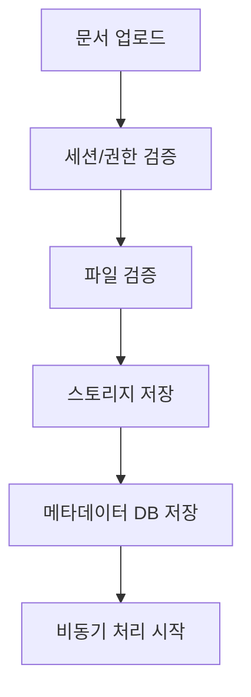
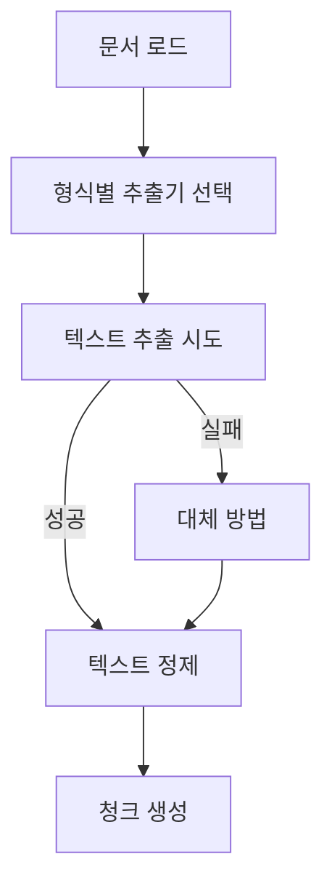
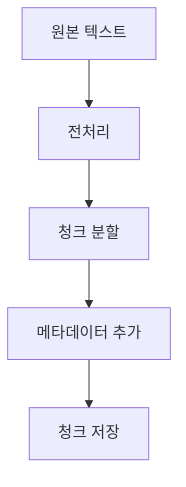
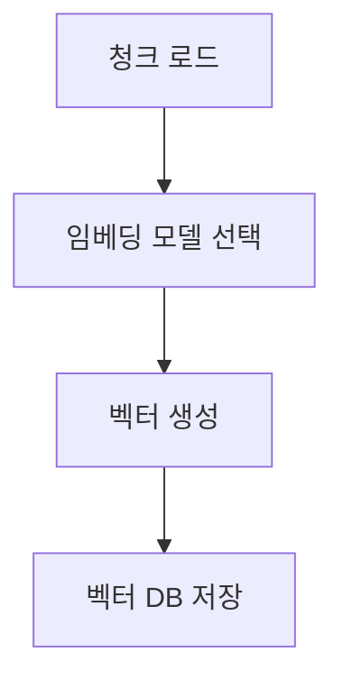

# Intellio 개발 가이드

## 프로젝트 소개
Intellio는 FastAPI 기반의 지능형 문서 관리 시스템으로, 다양한 형식의 문서를 효율적으로 처리하고 분석하는 서비스입니다.

### 핵심 기능
- 다양한 형식의 문서 업로드 및 처리
- AI 기반 문서 분석
- 대용량 문서 처리 (100페이지 이상)
- 실시간 문서 검색 및 분석

## 1. 시스템 요구사항

### 필수 소프트웨어
1. 기본 개발 환경
   - Python 3.12 이상
   - Node.js 18+ 및 npm
   - Git

2. 데이터베이스 및 캐시
   - PostgreSQL 13+
   - Redis 6+ (WSL Ubuntu 환경)

3. 문서 처리 관련
   - Visual C++ Build Tools
   - Tesseract OCR
   - HWP Viewer (한글 문서 지원)

4. 개발 도구
   - Visual Studio Code (권장)
   - Windows Terminal
   - WSL (Windows Subsystem for Linux)
   - Docker Desktop (선택사항)

5. Python 패키지 (주요)
   - FastAPI 0.109.0
   - SQLAlchemy 2.0.25
   - Pydantic 2.5.3
   - OpenAI 1.6.1
   - PyMuPDF 1.23.8
   - python-docx 1.0.1
   - pytesseract 0.3.10
   - python-hwp 0.2.0

6. Node.js 패키지 (주요)
   - Next.js 13+
   - React 18+
   - TailwindCSS
   - TypeScript

### 권장 사양
- CPU: 4코어 이상
- RAM: 8GB 이상
- 저장공간: 20GB 이상
- 네트워크: 안정적인 인터넷 연결

## 2. 프로젝트 구조

### 백엔드 구조 (backend_new/)
```
backend_new/
├── alembic/                # 데이터베이스 마이그레이션
│   ├── versions/          # 마이그레이션 버전 파일들
│   └── env.py            # 마이그레이션 환경 설정
├── app/                    # 메인 애플리케이션
│   ├── api/              # API 엔드포인트
│   │   ├── v1/          # API 버전 1
│   │   │   ├── auth.py      # 인증 관련 API
│   │   │   ├── projects.py  # 프로젝트 관련 API
│   │   │   └── documents.py # 문서 관련 API
│   │   └── deps.py      # API 의존성
│   ├── core/            # 핵심 설정 및 유틸리티
│   │   ├── config.py    # 환경 설정
│   │   ├── security.py  # 보안 관련
│   │   └── celery_app.py # Celery 설정
│   ├── credentials/     # 인증 관련
│   │   └── auth.py      # 인증 로직
│   ├── crud/           # 데이터베이스 CRUD 작업
│   │   ├── base.py     # 기본 CRUD 작업
│   │   ├── project.py  # 프로젝트 CRUD
│   │   └── document.py # 문서 CRUD
│   ├── models/         # 데이터베이스 모델
│   │   ├── project.py  # 프로젝트 모델
│   │   ├── document.py # 문서 모델
│   │   └── user.py     # 사용자 모델
│   ├── schemas/        # Pydantic 모델
│   │   ├── project.py  # 프로젝트 스키마
│   │   └── document.py # 문서 스키마
│   ├── services/       # 비즈니스 로직
│   │   ├── project.py  # 프로젝트 서비스
│   │   └── document.py # 문서 서비스
│   ├── websockets/     # 웹소켓 처리
│   │   └── connection.py # 웹소켓 연결 관리
│   ├── workers/        # Celery 워커
│   │   ├── tasks.py    # Celery 태스크
│   │   └── utils.py    # 워커 유틸리티
│   └── main.py         # 애플리케이션 진입점
├── migrations/          # 데이터베이스 마이그레이션 스크립트
├── scripts/            # 유틸리티 스크립트
├── tests/              # 테스트 코드
│   ├── api/           # API 테스트
│   ├── crud/          # CRUD 테스트
│   └── services/      # 서비스 테스트
├── .env               # 환경 변수
└── requirements.txt    # Python 의존성
```

### 프론트엔드 구조 (frontend/)
```
frontend/
├── app/                # Next.js 13+ 앱 디렉토리
│   ├── auth/          # 인증 관련 페이지
│   ├── projects/      # 프로젝트 관련 페이지
│   └── documents/     # 문서 관련 페이지
├── components/         # 재사용 가능한 컴포넌트
│   ├── common/        # 공통 컴포넌트
│   │   ├── Button/    # 버튼 컴포넌트
│   │   ├── Input/     # 입력 컴포넌트
│   │   └── Modal/     # 모달 컴포넌트
│   ├── layout/        # 레이아웃 컴포넌트
│   └── project/       # 프로젝트 관련 컴포넌트
├── contexts/          # React Context
│   ├── AuthContext.ts # 인증 컨텍스트
│   └── ProjectContext.ts # 프로젝트 컨텍스트
├── hooks/             # 커스텀 React Hooks
│   ├── useAuth.ts     # 인증 훅
│   └── useProject.ts  # 프로젝트 훅
├── lib/               # 유틸리티 함수
│   ├── api.ts        # API 클라이언트
│   └── utils.ts      # 유틸리티 함수
├── services/          # API 통신 서비스
│   ├── auth.ts       # 인증 서비스
│   └── project.ts    # 프로젝트 서비스
├── styles/            # CSS 스타일
│   ├── globals.css   # 전역 스타일
│   └── components/   # 컴포넌트별 스타일
├── templates/         # 페이지 템플릿
├── types/            # TypeScript 타입 정의
│   ├── project.ts    # 프로젝트 타입
│   └── document.ts   # 문서 타입
├── .env              # 환경 변수
├── next.config.mjs   # Next.js 설정
├── package.json      # 의존성 관리
├── tailwind.config.js # Tailwind CSS 설정
└── tsconfig.json     # TypeScript 설정
```

### 백엔드 주요 디렉토리
- `api/`: REST API 엔드포인트 정의
- `core/`: 애플리케이션 핵심 설정 및 유틸리티
- `models/`: SQLAlchemy 데이터베이스 모델
- `schemas/`: Pydantic 데이터 검증 스키마
- `services/`: 비즈니스 로직 구현
- `workers/`: 비동기 작업 처리를 위한 Celery 워커

### 프론트엔드 주요 디렉토리
- `app/`: Next.js 13+ 기반 페이지 구성
- `components/`: 재사용 가능한 React 컴포넌트
- `contexts/`: 전역 상태 관리
- `hooks/`: 재사용 가능한 React 로직
- `services/`: 백엔드 API 통신 로직
- `styles/`: UI 스타일링 관련 파일

## 3. 문서 처리 시스템

### 문서 처리 파이프라인

#### 1. 업로드 및 초기 처리



1. 업로드 검증
   ```python
   # 1. 세션 및 권한 검증
   session = await validate_session(session_id)
   project = await validate_project(project_id)
   
   # 2. 파일 검증
   allowed_types = [
       'text/plain', 'application/pdf',
       'application/msword', 'application/vnd.openxmlformats-officedocument.*',
       'image/jpeg', 'image/png', 'image/tiff'
   ]
   ```

2. 초기 저장
   ```python
   # 1. 스토리지에 파일 저장
   file_path = f"projects/{project_id}/documents/{file_id}"
   await storage_service.upload_file(file_path, file_content)
   
   # 2. DB에 메타데이터 저장
   document = Document(
       id=file_id,
       project_id=project_id,
       status=DOCUMENT_STATUS_REGISTERED
   )
   ```

#### 2. 텍스트 추출 프로세스



1. 형식별 추출기
   ```python
   extractors = {
       'text/plain': extract_from_text,
       'application/pdf': extract_from_pdf,
       'application/msword': extract_from_doc,
       'image/*': extract_from_image
   }
   ```

2. 추출 방법
   - PDF: PyMuPDF (fitz)
   ```python
   def extract_from_pdf(content):
       doc = fitz.open(stream=content)
       text = ""
       for page in doc:
           text += page.get_text()
       return text
   ```
   
   - 이미지: Google Cloud Vision
   ```python
   def extract_from_image(content):
       image = vision.Image(content=content)
       response = vision_client.text_detection(image=image)
       return response.text_annotations[0].description
   ```
   
   - 워드: Apache Tika
   ```python
   def extract_from_doc(content):
       parsed = parser.from_buffer(content)
       return parsed["content"]
   ```

#### 3. 텍스트 청크 생성



1. 텍스트 전처리
   ```python
   def preprocess_text(text):
       # 1. 불필요한 공백 제거
       text = re.sub(r'\s+', ' ', text)
       
       # 2. 특수문자 처리
       text = re.sub(r'[^\w\s\.,!?]', '', text)
       
       # 3. 문단 구분
       paragraphs = text.split('\n\n')
       return paragraphs
   ```

2. 청크 생성
   ```python
   def create_chunks(text, max_size=1000):
       chunks = []
       current_chunk = ""
       
       for paragraph in text.split('\n\n'):
           if len(current_chunk) + len(paragraph) <= max_size:
               current_chunk += paragraph + "\n\n"
           else:
               chunks.append(current_chunk)
               current_chunk = paragraph + "\n\n"
               
       if current_chunk:
           chunks.append(current_chunk)
           
       return chunks
   ```

#### 4. 임베딩 생성



1. 임베딩 프로세스
   ```python
   async def create_embeddings(chunks):
       embeddings = []
       for chunk in chunks:
           # 1. 임베딩 생성
           vector = await openai.Embedding.acreate(
               input=chunk,
               model="text-embedding-ada-002"
           )
           
           # 2. 벡터 DB 저장
           await vector_db.insert({
               'text': chunk,
               'vector': vector.data[0].embedding,
               'metadata': {'source': document_id}
           })
   ```

2. 벡터 저장소 구조
   ```python
   vector_store = {
       'id': UUID,
       'text': str,           # 원본 텍스트
       'vector': List[float], # 임베딩 벡터
       'metadata': {
           'document_id': UUID,
           'page_number': int,
           'chunk_index': int
       }
   }
   ```

### 프롬프트 처리 시스템

#### 1. 모드별 처리

1. 채팅 모드
   ```python
   # 시스템 프롬프트
   CHAT_SYSTEM_MSG = (
       "사용자가 읽기 쉽도록 적절히 띄어쓰기를 활용"
       "1.문서의 내용에만 기반하여 답변. 2.관련 내용이 없다면 '관련 내용이 문서에 없습니다'로 응답. "
       "3.불확실한 내용은 추측하지 않음. 본문 내용은 그대로 반환하되 사용자의 요청이 있기 전까진 한국어로 응답."
   )
   
   @router.post("/chat")
   async def chat_search(request: ChatRequest):
       """채팅 모드 검색 및 질의응답"""
       result = await rag_service.query(
           query=request.message,
           mode="chat",
           document_ids=request.document_ids
       )
       return result
   ```

2. 테이블 모드
   ```python
   # 테이블 헤더 생성 프롬프트
   TABLE_HEADER_SYSTEM_MSG = """
   사용자의 자연어 명령을 2-3단어로 된 간단한 헤더로 변환하세요.
   
   규칙:
   1. 반드시 2-3단어로 구성된 헤더만 생성
   2. 헤더는 명사형으로 끝나야 함
   3. 명령의 핵심 의미를 포함해야 함
   4. 불필요한 조사나 어미 제거
   """
   
   # 테이블 내용 생성 프롬프트
   TABLE_CONTENT_SYSTEM_MSG = (
       "주어진 문서에서 지정된 항목에 대한 내용을 추출하세요. "
       "다음 규칙을 반드시 따르세요:\n"
       "1. 항목에 정확히 대응하는 내용만 추출\n"
       "2. 문서에 없는 내용은 '내용없음'으로 표시\n"
       "3. 추측이나 해석 없이 원문의 내용만 사용\n"
       "4. 내용은 간단명료하게 정리"
   )
   
   @router.post("/table/search")
   async def table_search(request: TableQueryRequest):
       """테이블 모드 검색 및 질의응답"""
       result = await rag_service.query(
           query=request.query,
           mode="table",
           document_ids=request.document_ids
       )
       return result
   ```

#### 2. 모드별 응답 구조

1. 채팅 응답
   ```python
   class ChatContext(BaseModel):
       """채팅 컨텍스트"""
       text: str    # 참조한 문서 내용
       score: float # 관련도 점수

   class ChatResponse(BaseModel):
       """채팅 응답"""
       answer: str                # AI 답변
       context: List[ChatContext] # 참조 컨텍스트
   ```

2. 테이블 응답
   ```python
   class TableHeader(BaseModel):
       """테이블 헤더"""
       id: str           # 헤더 ID
       text: str         # 헤더 텍스트
       width: int        # 칼럼 너비
       sortable: bool    # 정렬 가능 여부

   class TableCell(BaseModel):
       """테이블 셀"""
       text: str         # 셀 내용
       document_id: str  # 문서 ID
       confidence: float # 신뢰도 점수

   class TableColumn(BaseModel):
       """테이블 칼럼"""
       header: TableHeader    # 칼럼 헤더
       cells: List[TableCell] # 셀 목록

   class TableResponse(BaseModel):
       """테이블 응답"""
       columns: List[TableColumn] # 칼럼 목록
   ```

#### 3. 모드별 처리 과정

1. 채팅 모드 처리
   ```mermaid
   graph TD
       A[사용자 메시지] --> B[문서 검색]
       B --> C[관련 문서 선택]
       C --> D[컨텍스트 구성]
       D --> E[GPT 답변 생성]
       E --> F[응답 반환]
   ```

   처리 단계:
   - 메시지 분석 및 키워드 추출
   - 벡터 검색으로 관련 문서 찾기
   - 상위 N개 문서로 컨텍스트 구성
   - GPT 모델로 답변 생성
   - 답변과 참조 컨텍스트 반환

2. 테이블 모드 처리
   ```mermaid
   graph TD
       A[사용자 질의] --> B[헤더 생성]
       B --> C[문서별 내용 추출]
       C --> D[테이블 구성]
       D --> E[응답 반환]
   ```

   처리 단계:
   - 질의를 테이블 헤더로 변환
   - 각 문서에서 헤더별 내용 추출
   - 추출된 내용으로 테이블 구성
   - 정렬 및 필터링 적용
   - 테이블 형태로 응답 반환

#### 4. 공통 기능

1. 문서 접근 권한 확인
   ```python
   async def verify_document_access(document_id: str) -> bool:
       """문서 접근 권한 확인"""
       # 1. 문서 존재 여부 확인
       document = await get_document(document_id)
       if not document:
           return False
           
       # 2. 문서 상태 확인
       if document.status not in ['COMPLETED', 'PARTIAL']:
           return False
           
       return True
   ```

2. 문서 상태 확인
   ```python
   class DocumentStatusResponse(BaseModel):
       """문서 상태 응답"""
       document_id: str
       status: str
       error_message: Optional[str]
       is_accessible: bool
   ```

## 3. Docker 개발 환경 설정

### 필수 요구사항
1. Docker Desktop 설치
2. Java 설치 (Tika 서버용)
3. Git 설치

### 개발 환경 구성 프로세스

1. **프로젝트 클론**
   ```bash
   git clone [저장소 URL]
   cd intellio
   ```

2. **환경 변수 설정**
   - `backend_new/.env.example`을 복사하여 `.env` 생성
   ```bash
   cp backend_new/.env.example backend_new/.env
   ```
   - 필요한 값 설정:
     * DATABASE_URL
     * REDIS_HOST, REDIS_PORT
     * PINECONE_API_KEY, PINECONE_ENVIRONMENT, PINECONE_INDEX_NAME
     * Google Storage 인증 정보

3. **Tika 서버 설치 및 실행**
   - Tika 서버는 성능과 안정성을 위해 서버에 직접 설치
   - 설치 및 실행 방법은 시스템 관리자에게 문의

4. **Docker 컨테이너 실행**
   ```bash
   # 컨테이너 빌드 및 시작
   docker-compose up -d

   # 로그 확인
   docker-compose logs -f
   ```

5. **서비스 접속 정보**
   - Frontend: http://localhost:3000
   - Backend API: http://localhost:8000
   - PostgreSQL: localhost:5433
   - Redis: localhost:6379

### 주의사항
1. 보안 관련 파일들은 Git에 포함되지 않음
   - .env
   - google-credentials.json
   - 기타 API 키

2. 외부 서비스 계정 필요
   - Pinecone
   - Google Cloud Storage
   - 기타 AI 서비스

3. 리소스 요구사항
   - 최소 8GB RAM
   - 여유 디스크 공간 20GB 이상

### 문제 해결
1. 컨테이너 로그 확인
   ```bash
   docker-compose logs [서비스명]
   ```

2. 컨테이너 재시작
   ```bash
   docker-compose restart [서비스명]
   ```

3. 전체 환경 초기화
   ```bash
   docker-compose down -v
   docker-compose up -d
   ```
